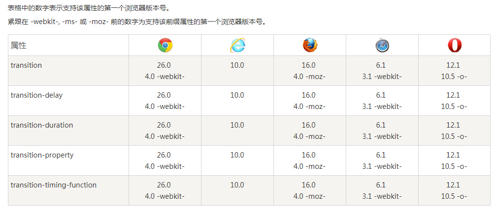

# CSS3过渡

## CSS3 过渡是元素从一种样式逐渐改变为另一种的效果。

要实现这一点，必须规定两项内容：

- 指定要添加效果的CSS属性

- 指定效果的持续时间。
```css
	div 
	{ 
	transition: width 2s, height 2s; 
	-webkit-transition: width 2s, height 2s; 
	}  
```
`transition是下面4个属性值的合并写法`
| 属性名称				| 属性值		|
| -----					| ---------																			|
|transition-property	| 规定应用过渡的 CSS 属性的名称														|
|transition-duration	| 定义过渡效果花费的时间。默认是 0													|
|transition-timing-function|规定过渡效果的时间曲线。默认是 "ease"。											|
|transition-delay		|规定过渡效果何时开始。默认是 0		

`transition-timing-function：	的几个属性值`

| 属性值				| 		说明|
| -----					| ---------																			|
|linear	| 规定以相同速度开始至结束的过渡效果（等于 cubic-bezier(0,0,1,1)）。												|
|ease	| 规定慢速开始，然后变快，然后慢速结束的过渡效果（cubic-bezier(0.25,0.1,0.25,1)）。	
|ease-in	| 规定以慢速开始的过渡效果（等于 cubic-bezier(0.42,0,1,1)）。
|ease-out	| 规定以慢速结束的过渡效果（等于 cubic-bezier(0,0,0.58,1)）。
|ease-in-out	| 规定以慢速开始和结束的过渡效果（等于 cubic-bezier(0.42,0,0.58,1)）。

# CSS3 box-shadow 属性
- box-shadow 属性向框添加一个或多个(用逗号分隔)阴影。
- `box-shadow: h-shadow v-shadow blur spread color inset;`
| 属性值				| 		说明	|																
| -----					| ---------	|																		
|h-shadow	| 必需。水平阴影的位置。允许负值。	|
|v-shadow	| 必需。垂直阴影的位置。允许负值。	|
|blur	| 可选。模糊距离。|
|spread	| 可选。阴影的尺寸。|
|color	| 可选。阴影的颜色|
|inset	| 可选。将外部阴影 (outset 默认) 改为内部阴影。|
